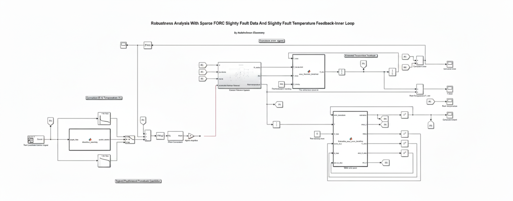

# Real-Time-Self-Sensing-SMA-Bending-Wire

An end-to-end multi-rate calibration framework and closed-loop thermal observer for Shape Memory Alloy (SMA) bending wire actuators, built using MATLAB and Simulink.

## 📝 Project Overview

Highly sensitive Shape Memory Alloy (SMA) actuators undergo material phase transitions that change their shape based on temperature. To control these actuators precisely, you need real-time temperature feedback. 

However, standard physical thermocouples suffer from an inherent **230ms response delay**. This massive latency introduces severe measurement lag, creating huge errors that critically degrade control over key physical outputs like curvature, strain, and angular position. 

This project solves this problem by bypassing physical thermocouples entirely during active control. It establishes a real-time **self-sensing methodology** that utilizes a fast current sensor (**1ms response time**). By continuously monitoring the dynamic electrical resistance changes that occur across the material's phases on the fly, the system calculates the active martensite volume fraction and estimates wire temperature in real time. 

## 🛠️ Pipeline & File Architecture

The repository is structured sequentially to move from raw multi-rate data to robust closed-loop tracking:

### 1. Multi-Rate Data Collection
* **`Step_1_Observer_Calibration_Experiment.slx`**: Runs the uncalibrated observer model under zero external load to generate high-frequency 1ms electrical readings against sparse 230ms thermocouple benchmarks.

### 2. Hysteresis Characterization
* **`Step_3_FORC_Extraction_Model.slx`**: Model configuration template for extracting custom multi-loop dynamic reversal maps.
* **`Step_4_FORC_Initialization.m`**: Loads the pre-compiled trajectory datasets to configure material parameters and establish baseline structural tracking limits.
* **`Step_4_FORC_Visualization.m`**: Plots First-Order Reversal Curves (FORC) to expose data gaps and evaluate structural hysteresis behavior.

### 3. Feedforward Control & Verification
* **`Step_5_FeedForward_LUTs_Extraction.m`**: Extracts trajectory Look-Up Tables (LUTs) by matching input voltage and convection cooling configurations against eliminated tracking errors.
* **`Step_6_Robustness_Analysis.slx`**: The final closed-loop controller testing framework evaluating system resilience across variable loads and supply voltage levels (2V, 4.5V, and 6V).

### 4. Calibration & Dataset Assets
* **`raw_forc_data.mat`**: Provides pre-collected, raw experimental coordinate points from the First-Order Reversal Curve data. This file is pre-loaded to save testers approximately 4 hours of local compilation and execution time.
* **`alpha_values.mat`**, **`beta_values.mat`**, **`forc_matrix.mat`**, **`valid_idx.mat`**: Mapped structural arrays and index masks dependencies required strictly by `Step_4_FORC_Visualization.m` to generate the complete hysteresis curve profiles.

---

## 💡 Crucial Hint:

The First-Order Reversal Curve (FORC) execution in Simulink (`Step_3`) is highly demanding and requires roughly **4 hours of hardware runtime** to gather consecutively minor temperature tracking loops. To save validation time, **do not run Step 3**. Instead, execute `Step_4_FORC_Initialization.m` directly. This script instantly unpacks the pre-loaded `raw_forc_data.mat` array and fully prepares your workspace environment variables for the downstream visualization and control steps.

## ⚠️ Thermal Observer Tracking Constraints Note

To prevent severe actuation errors under rapid temperature transitions, the thermal observer should be calibrated directly at the specific voltage level required for execution. Operating too far from the initial low-voltage calibration threshold incrementally increases steady-state tracking offsets along the cooling paths.
